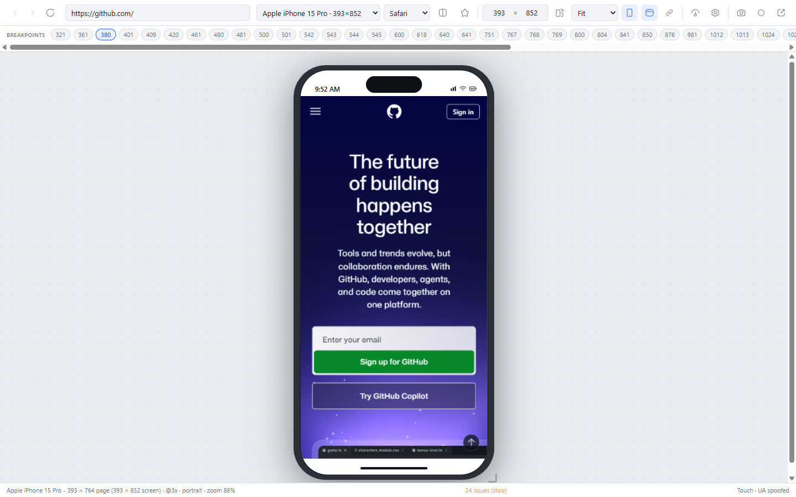
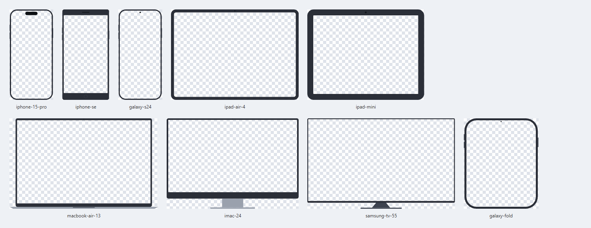

# Gonbi Viewport

A Chrome extension for checking responsive layouts. Pick from 60 devices grouped
into Phone, Tablet, Laptop and Desktop, and the site opens inside a
realistic device frame at that device's exact CSS viewport, with a matching
User-Agent.



Device frames are drawn from the catalogue's own dimensions, so the whole
repository is self-contained and MIT licensed - no third-party artwork.



## Install

No build step - the repository *is* the extension.

1. Open `chrome://extensions`
2. Turn on **Developer mode**
3. **Load unpacked** and select this folder

Released versions carry a loadable zip on the
[releases page](https://github.com/huy-tran/gonbi-viewport/releases), and what
changed in each is in [CHANGELOG.md](CHANGELOG.md).

## Using it

Click the toolbar icon to get the device picker. It opens on the current tab's
URL, so the usual flow is: browse to a page, click the icon, pick a device.

- **Search** is fuzzy: `ip15p` finds iPhone 15 Pro, `gs24` finds Galaxy S24,
  `mba` finds MacBook Air. Arrow keys and Enter work without touching the mouse.
- **Star** a device to pin it to the top of the list.
- Reopening the popup **from inside a viewer tab** swaps the device in place
  rather than opening another tab.
- **Right-click** a page or a link for *Open in Gonbi Viewport*, which skips the
  popup: the submenu lists the device you used last, your favourites and
  recents, and any saved comparison set. Right-clicking a link opens the link,
  not the page it is on, and doing this inside a viewer sends the site you are
  already looking at to another device.

In the viewer:

| Key | Action |
| --- | --- |
| `R` | Reload the framed page |
| `Alt+Left` / `Alt+Right` | Back / forward through the framed page's history |
| `Shift+R` | Rotate (phones and tablets only) |
| `C` | Comparison mode |
| `Y` | Sync scrolling across compared devices |
| `F` | Show/hide the device frame |
| `U` | Show/hide the simulated device UI |
| `I` | Responsive issues |
| `E` | Emulation options |
| `D` | Emulate dark mode (needs accurate mode) |
| `S` | Screenshot; `Shift+S` for the full page |
| `V` | Start/stop recording |
| `L` | Focus the URL bar |
| `?` | List every shortcut |
| `Escape` | Close any open panel |

That table is generated from the same `SHORTCUTS` array the key handler uses, so
pressing `?` in the viewer shows exactly what is wired up - the two cannot drift.

### Custom sizes and breakpoints

Any device's size can be overridden: type into the width/height fields, drag the
grip at the corner of the frame, or pass `?w=900&h=700`. A custom pane renders
bare, since no bezel fits an arbitrary size, and the reset button returns it to
the device's own dimensions.

The injected script also reads the framed page's own stylesheets and reports
every `@media` width condition it finds, which the viewer parses into a strip of
breakpoint chips. The chip for the band you are currently in is highlighted;
clicking one snaps the width to it, and alt-clicking snaps to one pixel below -
the fastest way to see both sides of a breakpoint.

Cross-origin stylesheets throw on `cssRules`, so a site serving CSS from a
separate CDN domain reports fewer breakpoints. The count of unreadable sheets is
shown next to the strip rather than quietly presenting a partial list as
complete.

### Finding problems

A viewer shows you the site small; the **Issues** badge (`I`) tells you what is
actually wrong at that width. The checks run inside the page, because only code
in there can read layout and computed styles:

- **Horizontal overflow** - the commonest mobile bug. Reports the element that
  *causes* it, not every descendant that inherits it: if a 900px div pushes past
  a 393px viewport, listing its children buries the one line you can act on.
- **Zoom restricted** - `user-scalable=no` or `maximum-scale` under 2 in the
  viewport meta. An outright WCAG 1.4.4 failure, and still copied around in
  boilerplate.
- **Images without alt** - a missing attribute only. `alt=""` is a deliberate
  "this is decorative" and correct.
- **Unlabelled form fields** - no label, `aria-label`, `aria-labelledby` or
  title, so a screen reader announces nothing.
- **Low text contrast** - below the WCAG AA ratio for its size. Text over an
  image or gradient is skipped rather than guessed at.
- **Small tap targets** - interactive elements below the 24px WCAG 2.5.8
  minimum, with a count of those under Apple's 44px guidance. Links flowing
  inside a sentence are exempt, as the spec allows, or every paragraph would be
  a false positive.
- **Small text** - computed font sizes under 12px.

The last two are touch-only, since 24px targets and 12px text are mobile
concerns. On a laptop you will only see the rest.

Hovering a finding outlines that element inside the framed page and scrolls it
into view. Every pane in a comparison is audited, grouped by device. A
`MutationObserver` in the page notices when the layout changes and marks the
findings **stale**, re-running automatically if the panel is open.

### Sweeping the breakpoints

**Sweep** takes the widths the page's own media queries declare, sets each one in
turn, audits at each, and gives you a table: `320px - 7 issues`, `768px - clean`.
It answers "where does this page break" rather than "how does it look here", and
it is the payoff for extracting breakpoints and free sizing separately. Clicking
a row jumps the viewport to that width; the original size is restored when the
sweep finishes.

A page can declare dozens of breakpoints - GitHub has 48 - so the sweep samples
evenly down to twelve, always keeping the narrowest and widest, where things
actually break.

**Export report** writes the findings and any sweep table as Markdown, named
after the site, and copies it to the clipboard for pasting into a ticket.

### Capturing

`S` saves the devices as they appear, bezels included. `Shift+S` captures the
leading pane's **full page** by scrolling the framed document a viewport at a
time and stitching the slices; animations are paused and fixed or sticky elements
are pinned first, or a sticky header would reappear in every slice. `V` records
the devices to WebM by cropping a tab-capture stream through a canvas.

Files are named after the site and the devices, so captures from different pages
do not collide: `github.com-iphone-15-pro-fullpage-12804px.png`.

`captureVisibleTab` only sees the window, so anything off it would be clipped.
Both capture paths therefore try 100% zoom first and shrink only if they must -
and a full-page capture only needs the *page area* on screen, not the bezel, so
it normally lands at 1:1 with the device viewport. When a downscale was
unavoidable the status line says so rather than quietly handing back an image
narrower than the device.

Only the panes are captured, never the dashed "Add device" tile that sits beside
them in comparison mode. A full-page capture also drops the bezel and squares off
the screen clip for the duration: the iframe's corners sit under the rounded
cutout, so otherwise every stitched slice contributed a sliver of bezel at its
top edge and the finished image carried a row of dark marks all the way down.
`tools/inspect-capture.mjs` writes crops of a real capture if you need to check
this after changing the frame or the geometry.

Recording tries `chrome.tabCapture` first and falls back to `getDisplayMedia`,
which costs one confirmation click - the extension only has `activeTab` access to
tabs where it was invoked, and it opens the viewer tab itself.

If a keyboard shortcut seems dead, focus is probably inside the framed page - a
cross-origin iframe swallows the keydown before the viewer sees it. Click the
stage background first, or use the toolbar button.

### Comparing devices

**Compare** in the toolbar (or `C`) turns on comparison mode. Up to six devices
render side by side at a shared zoom, each with its own viewport and device UI,
and a dashed **Add device** tile at the end of the row picks the next one.

Each pane is labelled with its own device dropdown, so a single device in the
comparison can be swapped in place without disturbing the others. The toolbar's
device picker stands down while comparing, since it would be a second control
for the same thing; leaving the mode collapses back to the leading device.

`Y` keeps their scroll positions in step, which the injected script reports back
to the viewer. A comparison is shareable as
`?devices=iphone-15-pro,ipad-air-4&compare=1`, and **Save set** stores it under a
name built from its devices for one-click reuse from the popup.

Swapping a trailing pane rebuilds only that pane, so the others keep their scroll
position and page state. The leading pane is the exception: it drives the tab's
header `User-Agent`, so changing it makes every pane's markup stale and they all
reload. When a reload is unavoidable the scroll position is restored afterwards.

**User agents per pane.** The viewer names each iframe `gonbi-pane-N`, and the
injected script reads `window.name` to pick its own device - synchronously, with
no frame-id mapping and no round trip a page script could run inside. So
`navigator.userAgent` is always correct per pane. Request *headers* are a
different matter: `declarativeNetRequest` rules are tab-scoped, so by default
every pane sends the leading device's UA. Turn on accurate mode and each frame
gets a real per-frame `Network.setUserAgentOverride` instead, keyed off the same
`window.name`.

### Browsers

Each device offers the browsers that actually run on it - Safari, Chrome,
Firefox and Edge on iOS; Chrome, Samsung Internet, Firefox and Edge on Android;
and so on. The strings are derived from the device rather than stored per
combination, so iOS Chrome correctly becomes a `CriOS` WebKit UA rather than a
desktop Chrome one. Picking a non-Chromium browser also stops the `Sec-CH-UA`
client hints being sent at all, as Safari and Firefox do.

### Signed-in sites

A framed site is cross-site to the extension page holding it, so the browser
treats it as a third party where cookies are concerned. In particular
**`document.cookie` reads back empty inside the frame** - verified, not assumed -
so a single-page app that keeps its session token in a cookie decides nobody is
signed in and redirects to its login page. Signing in there appears to do
nothing, because the token it writes goes nowhere either.

Request cookies are a separate question and depend on the browser: Chrome does
not necessarily treat an extension holding host permissions as a third party for
the request itself, so the `Cookie` header may arrive intact even with no help
from us. It is the script-visible half that reliably breaks, and a site with an
`HttpOnly` server session behind blocked third-party cookies needs the header
half too.

The **sign-in bridge** (the key button, next to accurate mode) carries your real
session in. It is off by default and remembered per host, because it hands a
site's cookies to a frame the browser had decided to withhold them from - fine
for the staging site you are testing, not something to do to every site you
preview.

It works in two halves:

- a `Cookie` request header written by a per-tab `declarativeNetRequest` rule,
  scoped to the framed host so one site's session can never be handed to
  another. This is the only route that reaches `HttpOnly` server sessions, and it
  is unaffected by third-party cookie blocking because the header is rewritten on
  the way out rather than read from a jar the frame is denied.
- a `document.cookie` shim in the framed page, seeded with the cookies a script
  is allowed to see. This is the half that fixes the common case. Reads merge in
  whatever the real store returns, so a frame that can see its own cookies is
  never made worse off. Writes are relayed back and written to the real jar,
  which is what makes signing in inside the viewer outlast the tab.

`HttpOnly` cookies are never handed to the shim - they ride the header, invisible
to page script, exactly as they would in a normal tab.

Two things it does not solve. A sign-in that needs a top-level navigation or a
popup - most OAuth and SSO flows - cannot complete in a sandboxed frame at all,
so sign in normally first and let the bridge carry the result. And a session
served from a *different* host than the page (an API on its own subdomain using
cookie auth rather than a token) is only bridged once the frame has been there,
since the rule follows the frame's host.

### Accurate mode

Some things cannot be faked from headers or injected script. Accurate mode
attaches `chrome.debugger` and emulates them properly: real device pixel ratio,
`prefers-color-scheme`, `prefers-reduced-motion`, `forced-colors`, vision
deficiencies (colour blindness, blurred vision, reduced contrast), network
throttling, and locale, time zone and geolocation overrides. They live in the
emulation panel behind `E`.

Chrome shows a debugging banner while it is on, and no other client can attach
to that tab meanwhile - including DevTools - which is why it is opt-in.

The framed site is cross-origin, so it runs out-of-process as its own CDP
target. The worker auto-attaches with `flatten: true` and sends the emulation
commands to that child session - sending them to the tab would only affect the
viewer's own toolbar. Metrics are overridden with `width: 0, height: 0` so the
device pixel ratio changes without disturbing the CSS-driven frame size.

## How it works

The site is loaded in an `<iframe>` inside an extension page, sized to the
device viewport. Three things make that behave like a real device:

**Framing.** Most sites refuse to be framed via `X-Frame-Options` or a CSP
`frame-ancestors` directive. A `declarativeNetRequest` rule strips those
response headers. The rules are **session rules scoped to a single tab id**, so
the relaxation only ever applies inside a viewer tab you deliberately opened -
normal browsing is untouched, and everything is dropped when the tab closes.

**Server-side detection.** The same per-tab rules rewrite the `User-Agent`
request header plus the `Sec-CH-UA-Mobile` / `Sec-CH-UA-Platform` client hints,
so servers send their mobile markup.

**Client-side detection.** Headers do not change what `navigator.userAgent`
reports inside the frame, so `src/inject/emulate.js` is injected into the framed
document in the MAIN world to override `userAgent`, `platform`,
`maxTouchPoints`, `devicePixelRatio` and friends. It also turns mouse drags into
`touchstart`/`touchmove`/`touchend` so swipe-driven carousels respond, exactly
as a real phone does by firing both touch and compatibility mouse events. Touch
devices additionally get overlay scrollbars - a classic scrollbar would silently
eat 15px of layout width and trip media queries 15px early.

That function is serialised across the process boundary by
`chrome.scripting.executeScript`, so it must stay entirely self-contained: no
imports, no closure over module scope. It is injected in one call rather than
two so that none of the page's own scripts can run between spoofing steps.

**Staying in step with the frame.** A cross-origin frame's location cannot be
read, so the worker relays `webNavigation` commits back to the viewer. Without
that the address bar, reload, pop-out and device switching all keep pointing at
the page you started on. Only frames whose parent is the viewer itself count -
the site's own nested iframes must not move the address bar. Those same commits
drive the back/forward history.

**When a site still says no.** The iframe is sandboxed without
`allow-top-navigation`, so a page cannot bust out and navigate your viewer tab
away. If a site refuses to be framed by means headers cannot fix - a JavaScript
`window.top !== window.self` check, or an unreachable host - the viewer says so
and offers to open it in a normal tab, rather than leaving a blank rectangle.

**Frames and geometry.** Each device frame is an SVG whose screen is a real
cutout. The art is layered *above* the iframe, so the page shows through the
cutout while the bezel, notch / dynamic island stay drawn on top.
`src/data/frame-geometry.js` records where each cutout sits as a percentage of
its frame, and the viewer scales the art so the cutout lands exactly on the
device viewport.

**Device UI.** A real phone never gives a web page the whole screen: iOS and
Android reserve a status bar, modern phones reserve a home indicator, and on a
laptop the browser's own toolbar takes a slice off the top. Without that the
page renders flush to the glass, tucked under the notch. So the viewer draws
those bars and insets the iframe behind them, which also makes the reported
viewport honest - an iPhone 15 Pro is a 393×852 screen but only ever gives a
page about 393×764. The status bar shows both numbers.

Which bars appear is derived from the catalogue rather than annotated per
device: aspect ratio separates notched phones from home-button ones (>=1.9) and
modern tablets from the 4:3 generation (>=1.4), and the category decides between
OS bars and a browser toolbar. Rotating to landscape hides the iOS status bar
and shrinks the home indicator, as Safari does.

Toggle it with `U`, or pin it in a link with `?ui=0`. Turning it off gives back
the exact documented viewport for precise breakpoint work.

**Rotation** is limited to phones and tablets. A laptop, desktop or TV does not
turn, so the control is disabled and an `orientation=rotated` parameter is
ignored for them.

The iframe fills the cutout's *bounding box*, and on most phones that box's
corners land right on the device's outer curve - so a square iframe pokes its
corners out past the silhouette, with no bezel there to hide them. The build
step measures each cutout's corner radius and the viewer clips the iframe to it.
`tools/preview-frames.mjs` renders a contact sheet if you need to check
this after changing artwork.

```
manifest.json
assets/
  frames/           60 generated device frames (SVG, 56 KB total)
  icons/
src/
  background.js     tab-scoped DNR rules, navigation relay, accurate mode,
                    right-click menu
  data/             device catalogue, browser UAs, generated geometry and icons
  inject/           the MAIN-world script: spoofing, touch, audit, reporting
  lib/              fuzzy matcher, icons, device UI, breakpoints, storage,
                    cookies for the sign-in bridge, right-click menu choices
  popup/            device picker
  viewer/           viewer.js wires the toolbar and panes; geometry.js,
                    capture.js and audit-ui.js hold the parts worth testing
tools/              asset pipeline and tests (not shipped)
```

## Device frames

`tools/build-frames.mjs` draws all 60 frames as SVG from the viewport dimensions
in `src/data/devices.js`. Nothing else describes a device: add an entry to the
catalogue, re-run the generator, and its frame exists.

The screen is a genuine hole - an outer rounded rect and an inner one in a single
even-odd path - which is what lets the viewer layer the frame *above* the iframe
and let the page show through. Bezel thickness and corner radius come from the
device's class and viewport: a notched phone gets a thin uniform bezel and a
radius around 14% of its width, a home-button iPhone gets a forehead, chin and
square screen corners, laptops get a chin and a base. Those are proportions of
the hardware, not anyone's artwork.

Aspect ratio alone misreads foldables - a Galaxy Fold is 1.25:1 and has no home
button - so the forehead-and-chin treatment is reserved for the Apple devices
that actually had one.

The front camera is the one place the frame and the simulated device UI have to
agree, so the generator imports `chromeFor` and sizes the camera from the status
bar height it declares rather than from its own guess: an Apple dynamic island
pill, or the small punch-hole every Android in the catalogue really has, always
fitting inside the bar. Getting this wrong is visible - an oversized pill hangs
below the bar and sits on the page - so `test-units.mjs` asserts, for every
device, that the camera falls entirely within its status bar.

All 60 frames come to 56 KB, and `validate.mjs` checks every frame's cutout
matches its device viewport exactly.

```bash
cd tools
npm install
npm run build            # frames and icons
npm run build:frames     # src/data/devices.js -> assets/frames/*.svg + frame-geometry.js
npm run build:icons      # @hugeicons/core-free-icons -> icons.js + assets/icons/*.png
node preview-frames.mjs  # contact sheet of the frames, for eyeballing changes
```

## Icons

All UI icons come from the [Hugeicons](https://hugeicons.com) free set (MIT).
`build-hugeicons.mjs` pulls the chosen icons out of `@hugeicons/core-free-icons`
and writes `src/data/icons.js` as plain SVG markup, so the extension ships no
icon dependency and needs no build step at runtime. Markup is injected by
`src/lib/icon.js`, either declaratively:

```html
<button id="reload" data-icon="refresh"></button>
```

or from JS via `renderIcon('star', { filled: true })`.

| Used for | Hugeicons export |
| --- | --- |
| Popup header | `ComputerPhoneSyncIcon` |
| Frame toggle, app icon | `SmartPhone01Icon` |
| Favourite | `StarIcon` |
| Reload | `RefreshIcon` |
| Rotate | `OrientationPotraitToLandscapeIcon` |
| Screenshot | `Camera01Icon` |
| Open in a normal tab | `LinkSquare02Icon` |

To swap an icon, edit `ICON_MAP` in `tools/build-hugeicons.mjs` and re-run it.
`validate.mjs` fails the build if a `data-icon` name has no entry, or if an
inline `<svg>` creeps back into the HTML.

## Tests

```bash
cd tools
npm install
npm test          # fast: structural, unit, search, characters, lint
npm run test:e2e  # loads the extension in real Chrome, 81 end-to-end checks
npm run test:all  # both
npm run fix       # reformat and strip stray control characters
```

The individual pieces, if you want one of them:

| Script | Covers |
| --- | --- |
| `validate.mjs` | manifest refs, device/frame integrity, icon wiring |
| `test-units.mjs` | device UI, rotation, browser UAs, breakpoints, viewer geometry |
| `test-fuzzy.mjs` | search ranking, incl. every device matching its own name |
| `check-chars.mjs` | character hygiene; `--fix` strips control characters |
| `lint.mjs` | parses, imports resolve, no debug leftovers, formatting |
| `smoke.mjs` | the whole extension in real Chrome |

`.github/workflows/ci.yml` runs the fast suite; `smoke.mjs` is deliberately left
out of CI because it drives a real browser against live sites.

The sign-in bridge is the exception to "against live sites": asserting anything
about a cookie jar would otherwise mean shipping credentials, so `smoke.mjs`
starts a local server standing in for a site you are signed into - an `HttpOnly`
session, a script-readable token beside it, and a second hostname on the same
server to prove one host's cookies are not sent to another.

Two diagnostics exist for the things assertions cannot describe:
`preview-frames.mjs` draws a contact sheet of the generated frames, and
`inspect-capture.mjs` writes crops of a real full-page capture. Both were written
after a bug that a passing test had failed to notice.

`test-units.mjs` matters because the device UI and browser lists are *derived*
from aspect ratios and UA sniffing rather than annotated per device - a table
test is what stops a newly added device being silently misclassified.

`smoke.mjs` needs Chrome for Testing, because stable Chrome removed the
`--load-extension` switch:

```bash
npx @puppeteer/browsers install chrome@stable --path tools/browsers
```

## Limitations

- **Not every site can be framed.** Header stripping handles `X-Frame-Options`
  and `frame-ancestors`, but a site that checks `window.top !== window.self` in
  JavaScript, or serves over a scheme the iframe cannot use, will still refuse.
  The viewer detects this and offers to open the URL in a normal tab.
- **Compared devices share one User-Agent *header*** (the leading device's),
  because DNR rules are tab-scoped. `navigator.userAgent` is per-pane regardless,
  and accurate mode makes the headers per-pane too.
- **Audit findings are only as good as the layout at that moment.** They do not
  re-run when the page changes under you - use Re-check.
- **Synthesized touch is not full touch emulation.** Single-finger drags become
  touch events; pinch, multi-touch and momentum scrolling do not.
- **Device pixel ratio, dark mode, vision, locale and throttling need accurate
  mode**, which costs a Chrome debugging banner and blocks DevTools from
  attaching to that tab while it is enabled.
- **Breakpoints are only as complete as the readable stylesheets.** CSS served
  from another origin cannot be inspected; the unreadable count is shown.
- **Full-page capture is limited to 20000px** and to the leading pane. Pages
  that lazy-load on scroll may still capture placeholders.
- **Recording needs one confirmation click** when it falls back to
  `getDisplayMedia`, and saves WebM rather than GIF.
- **CSP is removed wholesale, inside the viewer tab only.** `declarativeNetRequest`
  can delete a header but not edit one directive out of it, so the page's other
  CSP protections are also dropped while it is framed. That is the reason the
  sign-in bridge is opt-in per host: a framed page is running with fewer
  protections than usual, so prefer signing in normally and letting the bridge
  carry the session, and keep it away from anything you would not test with.
- **The sign-in bridge cannot complete an SSO flow.** Anything that needs a
  top-level navigation or a popup - most OAuth and SSO - will not finish inside a
  sandboxed frame. Sign in normally first. A cookie session served from a host the
  frame has not visited is likewise only bridged once it goes there, since the
  rule follows the frame's host.
- **The simulated device UI is representative, not exact.** Bar heights are the
  standard values for each device class, not per-model measurements, and the
  status bar does not follow the page's `theme-color` the way real iOS does.
  Press `U` if you need the untouched viewport.
- **Outside accurate mode, device pixel ratio is reported, not rendered.**
  `devicePixelRatio` returns the device's value so `srcset` and `image-set` pick
  the right asset, but the page is rasterised at your monitor's real density.
- **Frames are stylised, not photoreal.** They are drawn from each device's
  dimensions, so the proportions and the screen cutout are exact, but they do not
  reproduce a specific handset's finish.
- **The iPad Mini is catalogued at 1024×768**, not the 6th generation's
  744×1133, because it is drawn as the 4:3 generation it shares a bezel style
  with.

## Licensing

The repository is **MIT licensed and self-contained** - see `LICENSE` and
`THIRD-PARTY-NOTICES.md`. Two things are worth knowing:

**Device frames** are generated by `tools/build-frames.mjs` from the viewport
dimensions in this repository. They are original work.

**Icons** come from the [Hugeicons](https://hugeicons.com) free set, which is MIT.
Because the package is only a dev dependency, its notice is reproduced in
`THIRD-PARTY-NOTICES.md` rather than relying on `tools/node_modules`.

An earlier revision used third-party device photography that could not be
redistributed. Those images and the pipeline that processed them were removed and
replaced with the generator, so everything in this repository is original work.

Device and browser names are trademarks of their owners, used only to identify
which hardware a viewport corresponds to.
